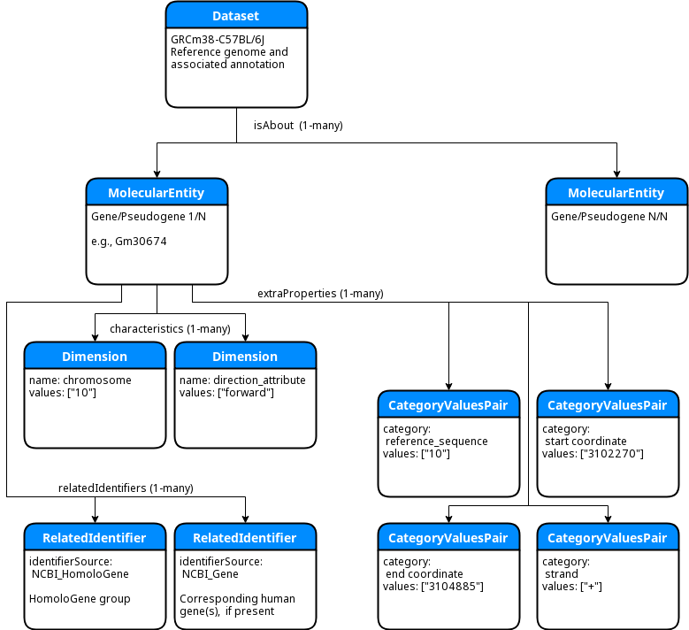
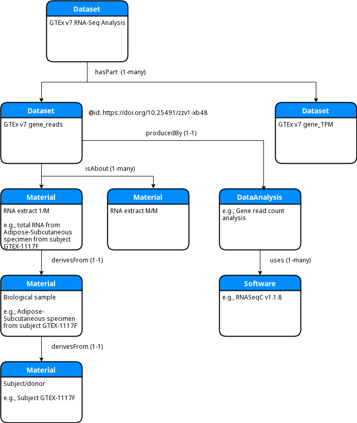

# KC7 Crosscut Metadata Model 

The aim of the crosscut metadata model is to provide a uniform encoding of metadata obtained 
from the following DCPPC data sources:

* AGR - [Alliance of Genome Resources](https://www.alliancegenome.org/)
* GTEx - [Genotype-Tissue Expression project](https://www.gtexportal.org/home/)
* TOPMed - [Trans-Omics for Precision Medicine](https://www.nhlbi.nih.gov/science/trans-omics-precision-medicine-topmed-program)


## Metadata Model versus Instance

The metadata _model_ specifies _how_ the various metadata will be transformed into a uniform representation,
whereas the metadata model _instance_ is the transformed representation itself. The metadata model is based
on a JSON-LD encoding of [DATS](https://www.nature.com/articles/sdata201759), the DatA Tag Suite data model 
developed through the Big Data To Knowledge (BD2K) initiative to support dataset discoverability. See below 
for a description of how each of the 3 main datasets' metadata are encoded in DATS.


## Downloading the Public Crosscut Metadata Model Instance

The crosscut metadata model instance, which is essentially a small set of JSON-LD files, is distributed as a
[BDBag](http://bd2k.ini.usc.edu/tools/bdbag/). BDBags for all current releases can be found in the 
[releases/](https://github.com/dcppc/crosscut-metadata/tree/master/releases)
subdirectory. Each BDBag is a gzipped tar file that can be retrieved, extracted and uncompressed with 
standard Unix or Mac OS command line utilities. On a Mac, for example, the latest (as of this writing) 
v0.3 release can be retrieved and uncompressed with the following commands:

```
$ curl -s -O 'https://raw.githubusercontent.com/dcppc/crosscut-metadata/master/releases/KC7-crosscut-metadata-v0.3.tgz'
$ tar xzvf KC7-crosscut-metadata-v0.3.tgz 
x KC7-crosscut-metadata-v0.3/
x KC7-crosscut-metadata-v0.3/tagmanifest-md5.txt
x KC7-crosscut-metadata-v0.3/bagit.txt
x KC7-crosscut-metadata-v0.3/bag-info.txt
x KC7-crosscut-metadata-v0.3/tagmanifest-sha256.txt
x KC7-crosscut-metadata-v0.3/manifest-md5.txt
x KC7-crosscut-metadata-v0.3/data/
x KC7-crosscut-metadata-v0.3/data/datasets/
x KC7-crosscut-metadata-v0.3/data/datasets/TOPMed_phs000946_wgs_public.json
x KC7-crosscut-metadata-v0.3/data/datasets/GTEx_v7_rnaseq_public.json
x KC7-crosscut-metadata-v0.3/data/datasets/MGD_GRCm38-C57BL6J_public.json
x KC7-crosscut-metadata-v0.3/data/docs/
x KC7-crosscut-metadata-v0.3/data/docs/RELEASE_NOTES
x KC7-crosscut-metadata-v0.3/data/docs/ChangeLog
x KC7-crosscut-metadata-v0.3/manifest-sha256.txt
```

After uncompressing the DATS JSON-LD files can be found in `KC7-crosscut-metadata-v0.3/data/datasets`:

```
$ ls -al KC7-crosscut-metadata-v0.3/data/datasets/
total 461888
drwxr-xr-x  5 jcrabtree  staff        160 Jun 27 15:35 .
drwxr-xr-x  4 jcrabtree  staff        128 Jun 27 15:35 ..
-rw-r--r--  1 jcrabtree  staff   48188564 Jun 27 15:35 GTEx_v7_rnaseq_public.json
-rw-r--r--  1 jcrabtree  staff  188240933 Jun 27 15:35 MGD_GRCm38-C57BL6J_public.json
-rw-r--r--  1 jcrabtree  staff      52537 Jun 27 15:35 TOPMed_phs000946_wgs_public.json
```

If this sounds like too much work (it isn't), the most recent raw JSON files can also be found in the 
[dats-json/](https://github.com/dcppc/crosscut-metadata/tree/master/dats-json) subdirectory of this
repository, in gzipped format.


## Building the Public Crosscut Metadata Model Instance

The script to build the public crosscut metadata model instance is called `make-crosscut-instance-bdbag.sh`
and can be found in the top level of this repository:

https://github.com/dcppc/crosscut-metadata/blob/master/make-crosscut-instance-bdbag.sh

The script contains the commands to perform the DATS metadata conversion for each of the currently supported
data (sub)sets, but as the comments in the file indicate, the metadata flat files for each of the data
sources must first be downloaded to the current directory:

### AGR/MGI

The script includes `curl` commands to download the requisite MGI flat files, but those commands are 
commented out by default:

```
mkdir -p mgd-data
cd mgd-data
curl -O http://www.informatics.jax.org/downloads/mgigff/MGI.gff3.gz
curl -O http://www.informatics.jax.org/downloads/reports/HOM_MouseHumanSequence.rpt
cd ..
```

### GTEx

For GTEx the following two files are needed from https://www.gtexportal.org/home/datasets:

```
GTEx_v7_Annotations_SubjectPhenotypesDS.txt
GTEx_v7_Annotations_SampleAttributesDS.txt
```

### TOPMed

For the example TOPMed study, phs000946, the public TOPMed metadata/variable summaries should be
downloaded from the following URL into a local directory named `phs000946.v3`:

```
ftp://ftp.ncbi.nlm.nih.gov/dbgap/studies/phs000946/phs000946.v3.p1/pheno_variable_summaries/
```

### Other Prerequisites

In order to run the part of the script that creates the BDBag, the `bdbag` command-line utility
must be installed:

```
pip install bdbag
```


## Building the Access-Restricted Crosscut Metadata Model Instance

The script mentioned above, `make-crosscut-instance-bdbag.sh`, also contains an example command showing
how to generate DATS JSON for the access-restricted metadata associated with the example TOPMed study,
phs000946. Simply add the access-restricted dbGaP files to the same local directory as the public 
files (or, even better, place them in a separate directory with appropriate access controls) and then 
tell the conversion script where to find the public and access-restricted metadata files, as in the 
following example command:

```
./bin/topmed_to_dats.py --dbgap_public_xml_path=./phs000946.v3 --dbgap_protected_metadata_path=./phs000946.v3 \
 --output_file=$EXTERNAL_ID/metadata/annotations/datasets/TOPMed_phs000946_wgs_RESTRICTED.json
```

## DATS-JSON validation

All of the DATS JSON-LD files produced by the scripts have been validated using the validator provided
in the main DATS repository, https://github.com/datatagsuite/WG3-MetadataSpecifications. Any changes to 
the DATS JSON should be checked against the validator before creating a new release of the metadata 
model instance. Note that although the DATS JSON files have been validated against the JSON schemas in 
the aforementioned `datatagsuite` repository, they will NOT validate against the current (v2.2) DATS 
release from the bioCADDIE project.


## Model Description

This section describes how the three datasets are currently encoded in DATS and discusses some of the tradeoffs
and shortcomings of the encoding. The encoding is by no means set in stone and the process of refining and
improving it is still ongoing. Concomitant adjustments are also being made to the DATS model in some cases to
facilitate the encoding of some aspects of the metadata.

### AGR/MGI encoding

The preliminary encoding for the MGI mouse reference genome annotation is quite simple. At the top level of the
DATS JSON is a DATS `Dataset` object that represents the C57BL/6J reference genome and MGI gene annotation. 
That top-level `Dataset` is linked by the `isAbout` property to an array of DATS `MolecularEntity` objects.
Each of those `MolecularEntity`s corresponds to an MGI gene, pseudogene, or gene/pseudogene segment. Within
each `MolecularEntity` the DATS properties are used as follows:

* `characteristics` - encodes the chromosome on which the gene is located as a DATS `Dimension`
* `alternateIdentifiers` - lists alternate (non-MGI) ids for the gene e.g., NCBI_Gene or ENSEMBL
* `relatedIdentifiers` - lists the HomoloGene id and any human genes linked via HomoloGene
* `extraProperties` - contains the reference sequence id, gene coordinates, and gene strand

The following simplified ER diagram illustrates this structure:



Note that the `extraProperties` attribute in DATS is intended as a catch-all list for any properties that
cannot be represented in a more structured way elsewhere in the DATS entity. In general we have adopted the
position and approach that it can also be used as a place to store minimally-modified (aka "raw" or 
"unharmonized") metadata from the original data source. As we improve the DATS encoding and metadata 
harmonization and as the DATS model itself evolves we expect more information to appear both in "raw"
form in `extraProperties` and also in DATS-compliant form elsewhere in the object. A simple example of 
this in the AGR/MGI encoding is the gene's reference sequence, which is encoded both in the `extraProperties`
(as a DATS `CategoryValuesPair` with category = "reference sequence") and also in the `characteristics` 
as a DATS `Dimension` with a structured `Annotation` type drawn from a controlled vocabulary (the SO
term for "chromosome", SO_0000340.)

Notes/Comments on AGR/MGI encoding:

* The HomoloGene ids and HomoloGene-derived human gene ids in `relatedIdentifiers` have DATS 
`relationType` = http://purl.obolibrary.org/obo/SO_0000853. This is the SO term for "homologous_region".
DATS only allows an IRI here, not a human-readable name and corresponding IRI, as is the case in some
other places. This is perhaps not ideal because it detracts somewhat from the readability of the instance 
for those who don't spend their days wrangling SO terms.
* DATS will soon be extended to allow a `MolecularEntity` to be related to other `MolecularEntity` objects.
This could be used in the MGI encoding to: 1. Directly relate genes to the chromosome on which they are
found or 2. Represent human homologs as full-fledged `MolecularEntity` objects in their own right.

### GTEx encoding

At the top level of the GTEx encoding is a DATS `Dataset` that represents the GTEx v7 RNA-Seq analysis.
This top level `Dataset` is linked by the `hasPart` property to an array of DATS `Dataset`s, each of 
which represents one of the public RNA-Seq data files available from https://www.gtexportal.org/home/datasets 
These sub-`Dataset`s make use of the KC2-provided DataCite GUIDs as their JSON-LD ids. For example, note 
the `doi.org` URL in the JSON snippet below:

```
      "@type": "Dataset",
      "@context": "https://w3id.org/dats/context/sdo/dataset_context.jsonld",
      "@id": "https://doi.org/10.25491/zzv1-xb48",
      "identifier": {
        "@type": "Identifier",
        "@id": "",
        "identifier": "GTEx_Analysis_2016-01-15_v7_RNA-SEQ_GTEx_Analysis_2016-01-15_v7_RNASeQCv1.1.8_gene_reads.gct.gz"
      },
```

Each of the second level DATS `Dataset` objects is in turn linked to an array of DATS `Material` objects
by the `isAbout` property. Each of those `Material`s represents an RNA extract used in the RNA-Seq protocol.
In DATS a `Material` may be linked one or more other `Material` objects via the `derivesFrom` property. In
the GTEx encoding each RNA extract `Material` is linked first (via `derivesFrom`) to a `Material` that 
represents a biological sample from a particular body site. That biological sample `Material` is further
linked (also via `derivesFrom`) to a `Material` that represents the individual human donor/subject, as
shown in the following ER diagram:



In the public version of the GTEx DATS encoding all of the human subjects, samples, and RNA extracts are
represented, but some of the phenotype and/or sample data may be limited. For example, instead of specifying
each subject's exact age, only an "Age range" (e.g,. "60-69") is provided.


Notes/Comments on GTEx encoding:

* There is a significant amount of redundancy in this encoding. Each RNA extract `Material`, along with its
associated biological sample and subject, is repeated for each and every one of the second-level `Dataset` 
objects. One alternative would be to link only the top-level RNA-Seq `Dataset` to the array of `Materials` and
say that the sub-`Dataset`s are implicitly "about" those `Material`s by dint of their relationship to the
parent `Dataset`. To our knowledge DATS itself does not require one or the other representation. Another 
option would be to keep the existing structure but make use of the JSON-LD ids to replace any duplicated
`Material` elements with references back to the first occurrence of each.
* The gross structure of the GTEx encoding differs from that of the TOPMed encoding in the following way:
in GTEx we have a single `Dataset` representing the GTEx v7 RNA-Seq data with a set of sub-`Dataset`s that
represent the individual analysis products produced by analyzing the RNA-Seq data. For TOPMed, on the other 
hand, there is a single top-level `Dataset` that represents the umbrella TOPMed project, below which 
there is a second level `Dataset` for each individual study within TOPMed. There are no third level 
`Dataset` objects that represent the datasets produced within each study. Therefore in a future release it
is likely that both the GTEx and TOPMed encodings may standardize on a 3-level `Dataset` structure at the 
top.


### TOPMed encoding

At the top level of the TOPMed encoding is an umbrella DATS `Dataset` that represents the overarching
TOPMed project. That `Dataset` links to one or more sub-`Dataset`s via the `hasPart` property. These
second level `Dataset`s represent the individual studies that comprise TOPMed. In the current instance
only one example TOPMed study is present at the second level, namely phs000946, the "Boston Early-Onset 
COPD Study in the TOPMed Program"  Within those second level `Dataset`s the organization is similar to
that used in GTEx, with each `Dataset` linked to an array of DATS `Material` objects by the `isAbout`
property. Each of those `Material`s represents a DNA extract and is linked (via `derivesFrom`) first 
to a biological sample and then (again via `derivesFrom`) to the human subject/donor. The following 
simplified ER diagram illustrates this structure:


Notes/Comments on TOPMed encoding:

* See the GTEx notes for a description of the inconsistency between the two levels of `Dataset` used at
the top of the GTEx encoding versus the two levels used at the top of the TOPMed encoding.